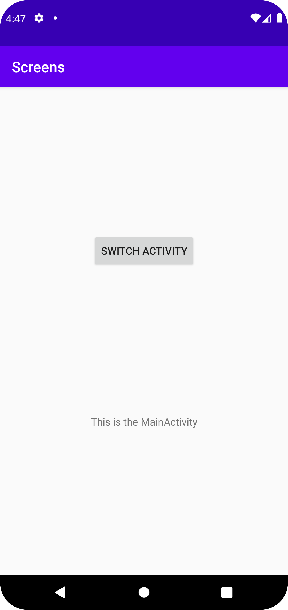
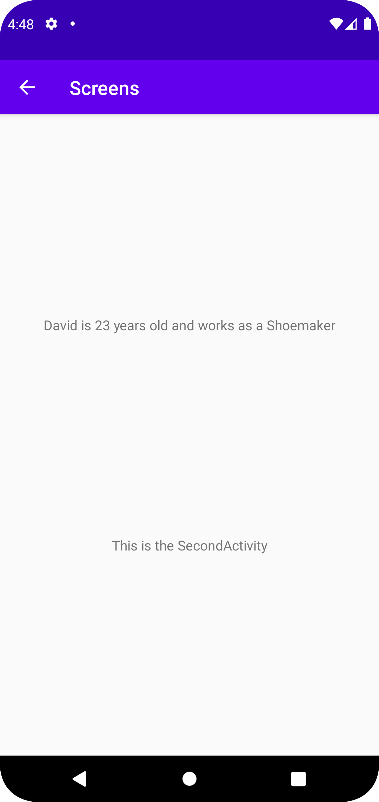

# Rapport


SecondActivity är ett barn till MainActivity
```
<activity
    android:name=".SecondActivity"
    android:exported="false"
    android:parentActivityName=".MainActivity"/>

```

Till MainActivity så lades det till en knapp som skikar informationen 
och tar de till SecondActivity.
```
switchButton = findViewById(R.id.switchButton);

switchButton.setOnClickListener(new View.OnClickListener() {
    @Override
    public void onClick(View v) {
        Intent intent = new Intent(MainActivity.this, SecondActivity.class);
        intent.putExtra("name", "David");
        intent.putExtra("job", "Shoemaker");
        intent.putExtra("age", 23);
        startActivity(intent);
    }
});
```

Till SecondActivity så lades det till en textView som tar emot information som skikades från 
MainActivity och säter det till sin text.
```
textFromMain = findViewById(R.id.textSentOver);

Bundle extras = getIntent().getExtras();
if (extras != null) {
    String name = extras.getString("name");
    String job = extras.getString("job");
    int age = extras.getInt("age");
    textFromMain.setText(name + " is " + age + " years old and works as a " + job);
}
```

MainActivity screen shot



SecondActivity screen shot


